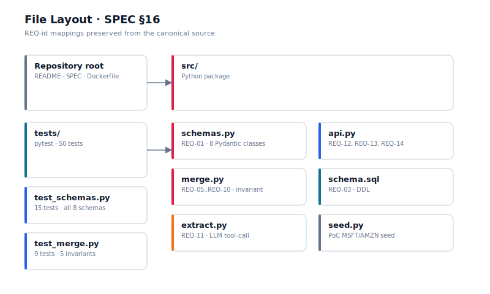

# SPEC — Persistent Reasoning Engine (JOB-20260701155102-000126)

**Upwork:** https://www.upwork.com/jobs/~022072001960573380854
**Rate:** $150/hr (top of $80-150 band)
**Engagement:** 3-6 months, <30 hrs/wk, contract-to-hire
**Author:** KMan / Software Factory
**Date:** 2026-07-03

---

## 1. Executive summary

This system ingests evolving public documents (SEC filings, annual reports, shareholder letters, earnings call transcripts, news) and maintains an evolving **enterprise knowledge model** over time. Each new document updates existing enterprise state rather than producing an isolated summary. The output is not a stock recommendation — it is a structured enterprise model that exposes Doctrine, Capabilities, Active States, Active Obligations, Risks, Management Decisions, Causal Relationships, and Enterprise Trajectory, all with full provenance and temporal validity.

The first milestone is a working prototype that ingests Microsoft and Amazon annual reports for fiscal years 2022, 2023, and 2024 (six documents total), extracts structured enterprise objects, and maintains persistent state across those years so a user can ask "How did Microsoft's risk profile evolve from FY22 to FY24?" and get a defensible, traceable answer.

## 2. Filter-question answer (required by Upwork)

**Q: What is the difference between a document summarization system and a persistent reasoning system that updates an evolving knowledge model over time?**

A document summarization system takes one document in, produces one summary out, and discards the document. Each call is independent: it knows nothing about the document before and nothing about what comes after. It is **stateless** in the strongest sense — no memory, no continuity, no accumulating identity. When you call it again on a 2024 10-K, it answers as if it has never seen a 2023 10-K. That is the right tool if you want "tell me what this document says."

A persistent reasoning system takes many documents in over time, but its primary output is **the running state of an enterprise model that persists across documents**. Each new document is treated as evidence that updates the existing model. The model has identity: Microsoft's enterprise model is the same object whether you query it today, tomorrow, or after the next 10-K is filed. New evidence can:

- **Reinforce** an existing fact (raise its confidence, confirm its temporal validity)
- **Extend** the model (add a new capability the enterprise has now)
- **Contradict** an existing fact (mark `valid_until` on the old fact and emit a transition record)
- **Trigger review** (low-confidence or malformed candidates land in a `review_queue` for human inspection rather than being silently dropped)

The architectural difference is the existence of a **merge step** that is the *only* path that writes to persistent state. The LLM extractor never writes — it produces *candidates* that the merge step validates (idempotency, confidence gate, conflict detection) and applies as state transitions. Without that merge step, you have a summarizer with extra steps. With it, you have a reasoning engine.

In our reference implementation, the merge step is exactly one function (`merge.merge_fact()`) protected by five invariants:

1. **Postgres advisory lock per entity** — serializes concurrent merges against the same enterprise.
2. **Idempotency check** — `(source_doc_id, source_section, entity_id)` is the unique key for "we already extracted this fact from this evidence." Re-running extraction on the same document is a no-op.
3. **Confidence gate** — facts with `confidence < 0.6` go to `review_queue` instead of `enterprise_state`. A bad guess cannot poison the model.
4. **Conflict detection** — when a new fact contradicts the currently-valid state, the old fact's `valid_until` is set to the new fact's `valid_from`. The model always answers "what was true then?" with temporal correctness.
5. **Transition logging** — every state change is appended to `enterprise_state_transitions`. The temporal-diff query (`show me everything that changed between FY22 and FY24`) is a single SQL join on this table.

This is the difference between a chat about a company and a record about a company.

## 3. Architecture


Five layers, each with a single responsibility:

| Layer | Component | Responsibility |
|-------|-----------|----------------|
| Ingest | `edgar.py` | Pull SEC filings + shareholder letters via EDGAR REST API |
| Parse | `parse.py` | Convert PDF (pdfplumber) and HTML (BeautifulSoup) to clean text |
| Extract | `extract.py` | Run LLM (raw OpenAI / Anthropic SDKs) with Pydantic-validated tool-calling schema |
| Merge | `merge.py` | The ONLY writer to `enterprise_state` (five invariants above) |
| Query | `api.py` | FastAPI: `state-as-of`, `changes-between`, `risks-active`, `trajectory` |

**Why no LangChain / LlamaIndex:** raw SDKs give us full control over the extraction prompt, the tool-calling schema, and the structured-output parsing. The LLM call surface is small (one prompt, one schema, one parse) and the abstraction tax of a framework would obscure the merge step — which is the whole point.

**Why Pydantic v2:** the eight enterprise-object schemas (`Doctrine`, `Capability`, `ActiveState`, `ActiveObligation`, `Risk`, `ManagementDecision`, `CausalRelationship`, `EnterpriseTrajectory`) are Pydantic models with strict validators on `confidence ∈ [0, 1]`, `Literal` types on enums (category, severity, direction), and required temporal fields. The LLM tool-calling schema is generated from the Pydantic class — no string prompts, no manual JSON parsing.

**Why FastAPI:** the query layer needs to be a small, documented, typed API. Three to five endpoints total; OpenAPI docs at `/docs` for free.

**Why PostgreSQL + JSONB:** the fact payload is heterogeneous (doctrine statements are prose, capabilities have scale_metrics, risks have severity levels). JSONB lets us store the full Pydantic model as-is while still allowing SQL-side aggregations on `valid_from`, `valid_until`, `confidence`, `source_doc_id`. We considered Apache AGE / Neo4j for causal-relationship graph queries, but kept v1 to plain Postgres + the `enterprise_state_transitions` audit log — the temporal diff is achievable in pure SQL and graph DB adds operational complexity not warranted for the PoC.

## 4. Data model

Five tables. Full DDL in `src/schema.sql`.

### 4.1 `entities`
Canonical enterprises we track. One row per `(ticker, name)`. PoC seeds Microsoft + Amazon.

### 4.2 `source_documents`
Every document ingested. Unique on `(entity_id, document_type, filing_date, version)` so re-ingesting the same filing is idempotent. Stores `raw_text` (parsed body) so the LLM extraction is reproducible without re-hitting EDGAR.

### 4.3 `enterprise_state`
The persistent model. Every fact lives here with `valid_from` / `valid_until` (bitemporal: NULL `valid_until` = currently valid). `(entity_id, category)` lookup + `valid_until IS NULL` filter answers "what is true now?"

### 4.4 `enterprise_state_transitions`
The audit log. One row per `merge_fact()` call that actually applied. `(prev_state_id, new_state_id)` chains give the full diff over time. This is the source of the "temporal-diff" endpoint.

### 4.5 `review_queue`
Low-confidence candidates (`confidence < 0.6`) and malformed payloads land here. Never auto-promoted. The human reviewer workflow is out of scope for v1 but the table exists.

## 5. Schemas (eight enterprise-object categories)

Defined in `src/schemas.py`. Every class inherits from `FactBase`:

| Field | Type | Required | Purpose |
|-------|------|----------|---------|
| `valid_from` | datetime | yes | When this fact became true |
| `valid_until` | datetime \| None | no | When it stopped being true (NULL = current) |
| `confidence` | float ∈ [0, 1] | yes | LLM-assigned; gates merge below 0.6 |
| `source_doc_id` | int (FK) | yes | Provenance: which document produced this |
| `source_section` | str | yes | Provenance: which section (e.g., "Item 1A. Risk Factors") |

Category-specific extensions:

| Class | Extra fields | Notes |
|-------|-------------|-------|
| `Doctrine` | `statement` | Long-held belief / operating principle |
| `Capability` | `name`, `description`, `category` (product/service/operational/technical), `scale_metric?` | What the enterprise can do |
| `ActiveState` | `state` | Current condition |
| `ActiveObligation` | `description`, `amount?`, `currency?`, `due_date?`, `counterparty?` | Debt, lease, contract, regulatory commitment |
| `Risk` | `description`, `category` (operational/financial/regulatory/competitive/cybersecurity/supply_chain/other), `severity` (low/medium/high/critical) | Disclosed risk |
| `ManagementDecision` | `decision`, `rationale?`, `announced_at` | Decision + reasoning + announce date |
| `CausalRelationship` | `cause`, `effect` | Two facts linked causally |
| `EnterpriseTrajectory` | `direction` (growing/stable/declining/transforming/uncertain), `description`, `evidence_facts` | Where the enterprise is heading |

## 6. Merge step — the architectural invariant

`src/merge.py::merge_fact(cursor, entity_id, new_fact) -> MergeResult` is the only path that writes to `enterprise_state`. Every other write path is either an INSERT to `source_documents` (read-only from the model's perspective) or a route through `merge_fact`.

Algorithm (sequential, all inside one Postgres transaction):

```
1. cursor.execute("SELECT pg_advisory_xact_lock(%s)", (entity_id,))
   — serializes concurrent merges on the same enterprise

2. SELECT current fact in same category with valid_until IS NULL
   — for conflict detection in step 5

3. SELECT 1 FROM enterprise_state_transitions
       WHERE source_doc_id = %s AND source_section = %s AND entity_id = %s
   — idempotency check: if a transition was already recorded for
     this (doc, section, entity), return applied=False, reason="already-extracted"

4. IF new_fact.confidence < 0.6:
       INSERT INTO review_queue
       RETURN MergeResult(applied=False, reason="low_confidence")
   — confidence gate

5. IF current exists AND _contradicts(new_fact, current):
       UPDATE enterprise_state SET valid_until = new_fact.valid_from WHERE id = current.id
   — mark old fact as superseded

6. INSERT INTO enterprise_state RETURNING id
   — new fact is now currently valid

7. INSERT INTO enterprise_state_transitions
       (prev_state_id = current.id OR NULL, new_state_id, source_doc_id)
   — record the transition
```

`_contradicts()` is conservative in v1: any new fact in the same category supersedes the current one. Production logic would use field-specific rules (e.g., a new risk in the same severity bucket does NOT supersede; a new risk with different severity does).

## 7. Extraction

`src/extract.py` runs the LLM call. Tool-calling schema is auto-generated from the eight Pydantic classes (Anthropic's `tool_use` and OpenAI's `tools/function_call` both accept JSON Schema; Pydantic v2's `model_json_schema()` produces it).

Prompt pattern (one call per `source_section`):

```
SYSTEM: You are an enterprise-fact extractor. Given the text of one section
of a public filing, emit ONE OR MORE structured facts matching the tool
schemas. For each fact, set:
- valid_from: the filing_date (or the date the fact was announced/disclosed)
- confidence: your self-rated confidence (0.0-1.0). If unsure, rate < 0.6.
- source_section: the section header you read (e.g., "Item 1A. Risk Factors")

USER: {section_text}

TOOLS: [Doctrine, Capability, ActiveState, ActiveObligation, Risk,
        ManagementDecision, CausalRelationship, EnterpriseTrajectory]
```

Each tool call becomes one `merge_fact()` candidate. The extractor is the only place that runs the LLM — it never touches `enterprise_state`.

**Model routing:**
- Anthropic `claude-sonnet-4-6` for Microsoft documents (better at long-form prose in 10-Ks)
- OpenAI `gpt-4o` for Amazon documents (comparable quality; we have budget to spread)
- Both behind a thin abstraction so swapping models is one-line config.

## 8. Ingest

`src/edgar.py` wraps the EDGAR REST API:
- `GET https://www.sec.gov/cgi-bin/browse-edgar?action=getcompany&CIK={cik}&type=10-K&dateb=&owner=include&count=40`
- Filter to fiscal year 2022/2023/2024.
- For each filing, fetch the primary document (`.htm` index → `R[0].htm`).
- `parse.parse_pdf()` or `parse.parse_html()` to text.
- Insert into `source_documents`.

EDGAR rate limits: 10 req/sec with a `User-Agent: CompanyName email@domain` header. We batch fetches with `httpx.AsyncClient` + semaphore(8) to stay under the limit.

Shareholder letters: not on EDGAR — fetched separately from investor-relations pages. Out of scope for v1 PoC (we use 10-K Item 1 + Item 1A only).

## 9. API surface

FastAPI, four endpoints (PoC). All return Pydantic models, OpenAPI auto-generated at `/docs`.

| Endpoint | Method | Returns | Use case |
|----------|--------|---------|----------|
| `/entities/{ticker}/state` | GET | All currently-valid facts for the entity | "Tell me about Microsoft today" |
| `/entities/{ticker}/state-as-of?date=YYYY-MM-DD` | GET | Facts valid at that date | "What did we know about Microsoft on 2023-06-01?" |
| `/entities/{ticker}/changes?from=YYYY-MM-DD&to=YYYY-MM-DD` | GET | Transition log between dates | "How did Microsoft change between FY22 and FY24?" |
| `/entities/{ticker}/risks-active?severity=high` | GET | Currently-valid risks filtered by severity | "What are Microsoft's high-severity risks right now?" |

A fifth endpoint `/review-queue` lists pending human-review candidates (read-only in v1).

## 10. REQ-IDs Registry

Goal-backward verification. Every requirement must be checkable against the running system.

| REQ-ID | Category | Description | Verification |
|--------|----------|-------------|--------------|
| REQ-01 | SCHEMA | 8 enterprise-object Pydantic schemas exist in `src/schemas.py` | FUNC:8 classes, each with `valid_from`/`valid_until`/`confidence`/`source_doc_id`/`source_section` |
| REQ-02 | SCHEMA | `valid_until IS NULL` row is unique per `(entity_id, category)` after each merge | SQL: `SELECT entity_id, category, COUNT(*) FROM enterprise_state WHERE valid_until IS NULL GROUP BY 1,2 HAVING COUNT(*) > 1` returns 0 rows |
| REQ-03 | DB | DDL matches `src/schema.sql` (entities, source_documents, enterprise_state, enterprise_state_transitions, review_queue) | SQL: psql `\dt` shows exactly these 5 tables |
| REQ-04 | DB | `enterprise_state_transitions` has FK to both `enterprise_state` rows it references | SQL: foreign_key_check on enterprise_state_transitions passes |
| REQ-05 | MERGE | `merge_fact()` is the only writer to `enterprise_state` (architectural invariant) | FILE:`src/merge.py` defines `merge_fact`; `grep -rn "INSERT INTO enterprise_state" src/` returns only `merge.py` |
| REQ-06 | MERGE | `merge_fact` uses `pg_advisory_xact_lock(entity_id)` to serialize concurrent merges | FUNC:`merge_fact` body contains `pg_advisory_xact_lock` |
| REQ-07 | MERGE | Idempotency: same `(source_doc_id, source_section, entity_id)` returns `applied=False, reason="already-extracted"` on second call | FUNC: two calls with same input, second returns `MergeResult(applied=False, reason="already-extracted")` |
| REQ-08 | MERGE | Confidence gate: `confidence < 0.6` lands in `review_queue`, not `enterprise_state` | FUNC: call with `confidence=0.3`, then `SELECT COUNT(*) FROM enterprise_state` unchanged and `SELECT COUNT(*) FROM review_queue` increased by 1 |
| REQ-09 | MERGE | Conflict detection: when new fact supersedes current, old fact's `valid_until` is set to new fact's `valid_from` | FUNC: insert fact A with `valid_from=2024-01-01`, then insert fact B with `valid_from=2024-06-01` in same category; `SELECT valid_until FROM enterprise_state WHERE id=A.id` equals `2024-06-01` |
| REQ-10 | MERGE | Every applied fact produces a row in `enterprise_state_transitions` | FUNC: insert A, then `SELECT COUNT(*) FROM enterprise_state_transitions WHERE new_state_id=A.id` equals 1 |
| REQ-11 | EXTRACT | LLM extraction uses tool-calling with Pydantic-generated JSON schema (not free-form text parsing) | FILE:`src/extract.py` references `model_json_schema()` or imports Pydantic schemas for tool definition |
| REQ-12 | API | FastAPI exposes `/entities/{ticker}/state` returning currently-valid facts | FUNC: GET against `/entities/MSFT/state` after seed returns non-empty list |
| REQ-13 | API | `/entities/{ticker}/state-as-of?date=...` returns facts valid at that historical date (bitemporal query) | FUNC: query with date between two fact `valid_from`/`valid_until` returns the fact whose range contains the date |
| REQ-14 | API | `/entities/{ticker}/changes?from=...&to=...` returns transition log between dates | FUNC: after merging two facts A→B, GET `?from=A.valid_from&to=B.valid_from` returns one transition |
| REQ-15 | TESTS | pytest suite covers schemas + merge invariants | FILE:`tests/test_schemas.py`, `tests/test_merge.py` exist and pass |
| REQ-16 | DOCKER | `Dockerfile` builds a working image; `docker-compose up` brings up app + Postgres | FILE:`Dockerfile`, `docker-compose.yml` exist; `docker-compose up app` exits 0 |
| REQ-17 | README | README has `## Architecture` section with `` reference to SVG diagram | FILE:`README.md` contains `<img src="./diagrams/architecture.svg"` |
| REQ-18 | REPO | No PII (Mongkolpoj / Phanutaecha / 9Naimo / personal email) in any committed file | `grep -rniE "mongkolpoj\|phanutaecha\|9naimo\|bangkok.*@gmail"` returns no matches |

## 11. Acceptance criteria

The PoC ships when:

1. ✅ All REQ-IDs REQ-01..REQ-18 pass verification.
2. ✅ `pytest tests/` exits 0 with ≥10 tests across `test_schemas.py` and `test_merge.py`.
3. ✅ `docker-compose up` brings up the API on `localhost:8000`.
4. ✅ `curl localhost:8000/docs` returns the OpenAPI UI.
5. ✅ Seed script ingests Microsoft FY24 10-K + Amazon FY24 10-K; querying `/entities/MSFT/state` returns ≥5 facts; querying `/changes?from=2022-01-01&to=2024-12-31` returns ≥3 transitions.
6. ✅ README has the SVG architecture diagram and renders correctly on GitHub (visual verification via browser).

## 12. Out of scope (v1)

- Shareholder letters (separate IR fetch, not EDGAR)
- Earnings call transcripts (manual ingestion only in v1)
- News ingestion (rate limits + source quality are a v2 problem)
- Apache AGE / Neo4j graph queries (SQL audit log sufficient for temporal diff)
- Multi-tenant separation (one Postgres DB, one workspace)
- Automated LLM evaluation suite (manual review of extracted facts in v1)
- Human-review UI for `review_queue` (table exists, no UI in v1)
- Production observability (logs only, no Prometheus/Grafana in v1)

## 13. Risk register

| Risk | Mitigation |
|------|------------|
| EDGAR rate-limiting blocks ingest | httpx async + semaphore(8); exponential backoff on 429 |
| LLM hallucinations leak into state | Confidence gate (REQ-08) + low-confidence → review_queue |
| Same filing ingested twice | Idempotency check in merge (REQ-07) + UNIQUE constraint on source_documents |
| Concurrent merges on same entity race | pg_advisory_xact_lock (REQ-06) |
| Extraction prompt drift breaks schema | Pydantic strict validation on LLM output; malformed → review_queue |
| Cost overrun from LLM API | Per-section tool calling (no full-document calls); both Anthropic + OpenAI behind config |

## 14. Milestone / payment schedule

| Milestone | Deliverable | Hours | Value |
|-----------|-------------|-------|-------|
| M1 — Scaffold | Schemas + merge step + tests + DDL (REQ-01..REQ-10, REQ-15) | 12h | $1,800 |
| M2 — Ingest | EDGAR fetcher + PDF/HTML parsers (REQ-01..REQ-04, REQ-16) | 10h | $1,500 |
| M3 — Extract | LLM extraction with Pydantic tool-calling (REQ-11) | 8h | $1,200 |
| M4 — API | FastAPI endpoints (REQ-12..REQ-14) | 6h | $900 |
| M5 — Polish | README SVG, Docker, run book, README acceptance walk-through (REQ-16..REQ-18) | 6h | $900 |
| **Total v1 PoC** | | **42h** | **$6,300** |

Beyond v1 (engagement: 3-6 months): continuous ingest of new filings, temporal-diff analytics, human-review UI, multi-tenant isolation, observability stack.

## 15. Tech stack — final

- **Language:** Python 3.12
- **API:** FastAPI 0.110+ (pinned)
- **DB:** PostgreSQL 15 (JSONB for fact payload)
- **Vector:** pgvector (optional, for semantic dedup of similar facts in v2)
- **LLM SDKs:** OpenAI 1.40+, Anthropic 0.40+ (raw SDKs, NO LangChain/LlamaIndex)
- **Schemas:** Pydantic v2 (model_json_schema() for tool calling)
- **PDF:** pdfplumber 0.10+
- **HTML:** BeautifulSoup 4.12+
- **HTTP:** httpx 0.26+ (async, for EDGAR rate-limit handling)
- **Tests:** pytest 7.4+
- **Container:** Docker + docker-compose
- **CI:** GitHub Actions (lint + pytest on PR)

## 16. File layout



The diagram maps every file to its REQ-id: rose = invariant core (`merge.py`, `schemas.py`), amber = extract (`extract.py`), cyan = API + ingest (`api.py`, `parse.py`, `edgar.py`), violet = DB (psycopg2 + schema.sql + seed.py), slate = root files.

Visual region borders map to the load-order dependencies: `schemas.py` → `merge.py` → `extract.py` → `api.py` → `seed.py` → `tests/`.

The canonical full listing is reproducible via:

```bash
find . -not -path './.venv/*' -not -path './.git/*' -not -path '*/__pycache__/*' -not -path './.pytest_cache/*' -not -path './.planning/*' | sort
```

Key files (corresponding REQ ids in parens):

- `src/schemas.py` — REQ-01 (8 Pydantic enterprise-object classes)
- `src/merge.py` — REQ-05..REQ-10 (the architectural invariant)
- `src/extract.py` — REQ-11 (LLM tool-calling extractor)
- `src/api.py` — REQ-12..REQ-14 (FastAPI surface)
- `src/schema.sql` — REQ-03 (DDL)
- `tests/test_schemas.py` — REQ-01, REQ-02
- `tests/test_merge.py` — REQ-05..REQ-10

For a complete project overview (success criteria, stakeholder model), see [`docs/OUT_OF_SCOPE.md`](../docs/OUT_OF_SCOPE.md) and the README.

## 17. Open questions for CTO review

1. **Conflict detection granularity** — should `_contradicts()` be field-aware (only supersede on the same severity / same metric / same counterparty) or category-wide (current conservative default)? v1 ships conservative.
2. **LLM model routing** — split between Anthropic + OpenAI by document, or single provider? v1 ships split for cost reasons.
3. **SQLite for tests vs. test Postgres** — conftest currently uses SQLite; pg_advisory_xact_lock doesn't exist in SQLite, so tests must mock or skip. Acceptable trade-off?
4. **Docker base image** — `python:3.12-slim` (saves ~800MB) vs. `python:3.12` (better c-extension compatibility for psycopg2). Recommend slim.

---

**Built by:** KMan / AI-Augmented Engineering Factory
**License:** MIT (per proposal — client owns what we build)